# ESP32-S3 + Logitech G102 硬件连点改造方案

本项目用于记录一套基于 ESP32-S3 和罗技 G102 鼠标的硬件级改造方案。

目标功能：

- 按住鼠标侧键时，ESP32-S3 触发连续左键点击。
- 松开侧键后，连续点击立即停止。
- 原鼠标左键保留正常使用能力。
- ESP32-S3 由电脑单独 USB 供电，不从鼠标内部取 5V。
- 暂时不加入“物理左键与侧键同时按下”的额外保护逻辑。

本 README 只讨论硬件方案。点击间隔、正态分布随机化、最小/最大间隔限制等逻辑后续由 ESP32 固件实现。

> 注意：拆解和焊接鼠标会失去保修。焊接前必须断电。首次通电前必须用万用表检查短路。

## 0. 当前现状与下一步实操

当前现状：

```text
硬件已经购买齐全。
不需要继续采购，也不需要先打 PCB。
下一步直接进入：测量确认 -> 洞洞板焊接 -> 鼠标飞线 -> 断电检查 -> 通电调试。
```

你现在应该按下面顺序操作，不要跳过万用表确认步骤。

### 0.0 整体思路速读

这个改造不是让 ESP32 变成一个新的 USB 鼠标，也不是切断 G102 原来的按键线路。整体思路是：

```text
侧键负责“告诉 ESP32 什么时候开始/停止”
ESP32 负责“决定点击节奏”
PC817 负责“像一个电子开关一样替你按下左键”
G102 原鼠标主控仍负责“向电脑上报鼠标事件”
```

也就是说，电脑看到的仍然是原来的 G102 鼠标。ESP32 不直接向电脑发送鼠标 HID 数据，而是在鼠标内部模拟“左键微动闭合”。

完整信号流程：

```text
人手按住侧键
    ↓
侧键信号从高电平变成 0V
    ↓
ESP32 GPIO4 读到低电平
    ↓
固件开始按设定节奏拉高/拉低 GPIO5
    ↓
GPIO5 拉高时，PC817 输入 LED 点亮
    ↓
PC817 输出三极管导通
    ↓
鼠标 LEFT 信号被拉到 GND
    ↓
G102 主控认为“左键按下”
    ↓
GPIO5 拉低时，PC817 关闭，左键恢复松开
```

这个方案的关键边界：

```text
侧键输入：鼠标 SIDE -> ESP32 GPIO4，只读取，不主动驱动鼠标
左键输出：ESP32 GPIO5 -> PC817 -> 鼠标 LEFT，只模拟短接到 GND
供电：鼠标和 ESP32 各走自己的 USB 5V，不互相供电
参考地：鼠标 GND 和 ESP32 GND 必须相连，否则 GPIO4 无法可靠判断高低电平
```

一句话概括：

```text
ESP32 读侧键，算节奏；PC817 负责把 ESP32 的节奏转换成鼠标能理解的左键闭合。
```

### 0.1 总体执行顺序

1. 拆开 G102，但先不要焊任何线。
2. 用万用表找出并标记三个鼠标焊点：`M-GND`、`SIDE`、`LEFT`。
3. 测量 `SIDE` 未按下时是约 `3.3V` 还是约 `5V`。
4. 在洞洞板上焊好 `PC817 + 电阻` 小模块。
5. 先做断电蜂鸣档检查，确认没有短路。
6. 再把鼠标三根线焊到洞洞板：`M-GND`、`SIDE`、`LEFT`。
7. 把 ESP32-S3 三根线接到洞洞板：`GND`、`GPIO4`、`GPIO5`。
8. 只插鼠标 USB，确认鼠标原功能正常。
9. 再插 ESP32-S3 USB，先运行低频测试固件，不要一上来跑高速连点。
10. 确认稳定后再做绝缘、热熔胶固定和外壳收纳。

实操接线关系见下图：

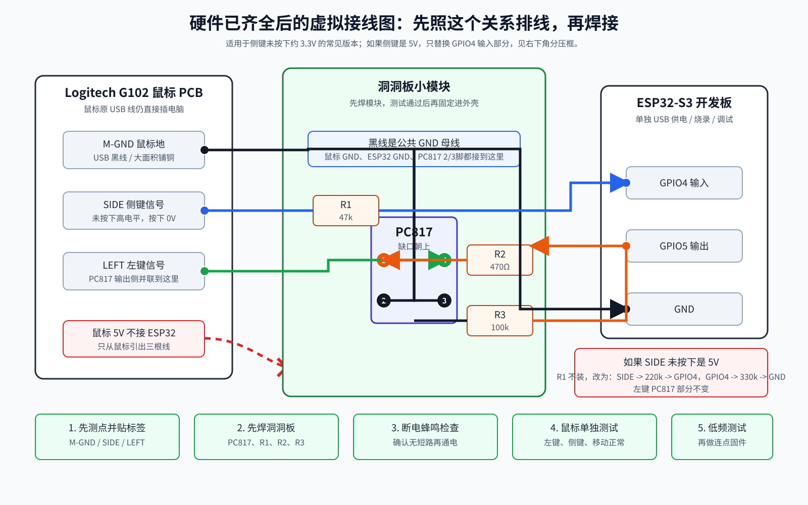

### 0.2 最重要的接线结论

如果实测结果是常见的 `3.3V` 侧键信号，按下面接：

```text
鼠标 M-GND -------------------------- ESP32 GND
鼠标 M-GND -------------------------- PC817 3脚
ESP32 GND --------------------------- PC817 2脚

鼠标 SIDE ---- 47kΩ ----------------- ESP32 GPIO4

ESP32 GPIO5 ---- 470Ω --------------- PC817 1脚
ESP32 GPIO5 ---- 100kΩ -------------- ESP32 GND

鼠标 LEFT --------------------------- PC817 4脚
```

如果实测 `SIDE` 未按下是约 `5V`，只替换侧键输入部分：

```text
鼠标 SIDE ---- 220kΩ ----+----------- ESP32 GPIO4
                         |
                       330kΩ
                         |
                        GND
```

左键模拟的 `PC817` 部分不变。

如果新版 G102 上 `SIDE` 测不到稳定的 `3.3V` 或 `5V`，例如一直接近 `0V`、读数跳动、按下前后变化不明显，不要继续按上面的侧键信号线方案焊接。此时大概率是 MCU 扫描式按键或新版 PCB 走线差异，改用 [19. 新版本 G102 扫描式兜底方案](#19-新版本-g102-扫描式兜底方案)。

严禁这样接：

```text
鼠标 USB 5V  ----X----  ESP32 5V / VIN
5V 侧键信号  ----X----  ESP32 GPIO4
```

### 0.3 万用表先确认什么

先插鼠标 USB 给鼠标供电，ESP32 先不要接。万用表打到直流电压档：

```text
黑表笔 -> 鼠标 M-GND
红表笔 -> 微动焊点
```

要找到下面两个信号焊点：

```text
LEFT：左键未按下约 3.3V 或 5V，按下约 0V
SIDE：侧键未按下约 3.3V 或 5V，按下约 0V
```

如果某个按键焊点不是稳定高电平，而是低电平、跳动电压、毫伏级读数，或者按下前后没有清晰变化，不要用万用表读数去凑 `3.3V` 结论。把它按扫描式按键处理，优先使用第 19 节的兜底方案。

某个焊点如果一直是 `0V`，通常是 `GND`，不是信号点。找到后在导线两端贴标签：

```text
M-GND：鼠标地
SIDE：侧键信号
LEFT：左键信号
```

### 0.4 洞洞板焊接顺序

先不要把洞洞板和鼠标 PCB 固定死，按下面顺序焊：

1. 剪一小块洞洞板，约 `10 x 8` 孔即可。
2. 放入 `PC817`，缺口或圆点朝上，只先焊两个对角脚固定。
3. 焊 `R2 470Ω`：`ESP32 GPIO5 -> R2 -> PC817 1脚`。
4. 焊 `R3 100kΩ`：`ESP32 GPIO5 -> R3 -> ESP32 GND`。
5. 如果 `SIDE` 是 `3.3V`，焊 `R1 47kΩ`：`SIDE -> R1 -> GPIO4`。
6. 如果 `SIDE` 是 `5V`，不要装 `47kΩ`，改焊 `220kΩ + 330kΩ` 分压。
7. 焊公共地线：`鼠标 M-GND`、`ESP32 GND`、`PC817 2脚`、`PC817 3脚` 连通。
8. 焊 `LEFT -> PC817 4脚`。
9. 焊完后用蜂鸣档逐项检查，确认没有意外短路。

PC817 顶视图方向再确认一次：

```text
        缺口 / 圆点
          ┌───────┐
  1脚  ───┤       ├─── 4脚
          │ PC817 │
  2脚  ───┤       ├─── 3脚
          └───────┘

1脚 -> 470Ω -> ESP32 GPIO5
2脚 -> ESP32 GND
3脚 -> 鼠标 M-GND
4脚 -> 鼠标 LEFT
```

`3脚` 和 `4脚` 不要接反。正确方向是 `4脚接 LEFT`、`3脚接 GND`。

### 0.5 鼠标 PCB 飞线和固定方法

建议使用 `30AWG` 特氟龙软线，每根线先预留比实际距离多 `3~5 cm` 的长度，调试通过后再整理。

鼠标 PCB 焊接建议：

- 每个焊点先少量上锡。
- 线头剥皮约 `1~2 mm`，也先上锡。
- 烙铁接触时间尽量短，焊上即可离开。
- 三根鼠标引线焊好后，先用胶带临时固定在线路板空白区域。
- 调试通过后再用热熔胶或 UV 胶做应力释放，避免拉线时扯掉焊盘。

不要把导线压在鼠标按键柱、滚轮、上盖卡扣、透镜或光学传感器附近。合盖前先不拧紧螺丝，确认线不会被压断，也不会影响左右键回弹。

### 0.6 首次调试顺序

焊完后按下面顺序通电：

1. `鼠标 USB` 和 `ESP32 USB` 都不插，先蜂鸣档查短路。
2. 只插 `鼠标 USB`，确认移动、左键、右键、侧键都正常。
3. 插 `ESP32 USB`，但固件先保持 `GPIO5 = LOW`，确认鼠标不会自动点击。
4. 用测试固件让 `GPIO5` 每 `2 秒` 输出一次短脉冲，确认电脑能识别左键点击。
5. 再测试按住侧键触发低频点击，例如 `500 ms` 一次。
6. 最后再实现目标的 `50~65 ms` 随机点击间隔。

调试时建议先不要封装。确认稳定后，再做热缩管、Kapton 胶带、热熔胶、UV 胶或外壳固定。

### 0.7 快速故障判断

如果插上后鼠标一直像左键按住：

```text
优先检查 PC817 3脚和4脚是否接反。
检查 LEFT 是否被焊锡短到 GND。
检查 GPIO5 是否上电就被固件拉高。
检查 100kΩ 下拉是否接好。
```

如果 ESP32 检测不到侧键：

```text
重新测 SIDE 焊点：未按下应为高电平，按下应为 0V。
检查鼠标 M-GND 和 ESP32 GND 是否连通。
如果 SIDE 是 5V，检查 220kΩ/330kΩ 分压节点是否接到 GPIO4。
```

如果 ESP32 输出了但鼠标不点击：

```text
检查 GPIO5 -> 470Ω -> PC817 1脚。
检查 PC817 2脚是否接 ESP32 GND。
检查 PC817 4脚是否接 LEFT，3脚是否接 M-GND。
GPIO5 高电平时，LEFT 应被拉到接近 0V。
```

### 0.8 购买前结论（背景）

当前硬件方案已经按 G102 公开拆解资料和器件参数重新核对过。

结论：

```text
可以买物料。
推荐使用：ESP32-S3 开发板 + 小洞洞板 + PC817 / EL817 + 电阻。
不需要先打嘉立创 PCB。
```

关键判断：

- G102 公开拆解资料提到“微动第一脚都是地，板子大面积铺铜接地”，这支持本项目的低电平触发假设。
- 左键适合用 PC817 输出侧并联模拟：`左键信号线 -> GND`。
- 侧键大概率也是按下拉低到 GND，ESP32 通过高阻输入读取。
- 不同 G102 批次可能有 PCB 差异，所以最终焊接前仍必须用万用表确认。

最终实测条件：

```text
左键未按下：约 3.3V 或 5V
左键按下：0V

侧键未按下：约 3.3V 或 5V
侧键按下：0V
```

如果你的鼠标实测符合上面结果，当前 README 中的 PC817 + 洞洞板方案可以使用。

建议购买的核心物料：

```text
PC817 / EL817，DIP-4 直插封装
470Ω，1/4W 直插金属膜电阻
330Ω，1/4W 直插金属膜电阻，备用
47kΩ，1/4W 直插金属膜电阻
100kΩ，1/4W 直插金属膜电阻
220kΩ，1/4W 直插金属膜电阻，侧键为 5V 时使用
330kΩ，1/4W 直插金属膜电阻，侧键为 5V 时使用
2.54mm 单面独立焊盘洞洞板
30AWG 多股特氟龙线，单色即可，手动标注线号
```

你已经具备松香、吸锡带等焊接辅助材料时，不需要重复购买。

热缩管不是电路必须件。30AWG 特氟龙线本身有绝缘外皮，但焊点、电阻脚、PC817 引脚、剥线线头和洞洞板背面焊锡桥仍然可能裸露。可以不买热缩管，但必须用绝缘胶带、Kapton 高温胶带、热熔胶、UV 胶或小外壳做好绝缘和固定。

详细采购清单见 [2.2 需要购买的物料](#22-需要购买的物料)。

G102 拆解资料核对见 [8.4 G102 拆解资料核对结论](#84-g102-拆解资料核对结论)。

参考资料见 [21. 参考资料](#21-参考资料)。

## 1. 设计目标

### 1.1 功能目标

侧键作为触发输入：

```text
按住侧键  -> ESP32-S3 开始模拟连续左键点击
松开侧键  -> ESP32-S3 停止模拟左键点击
```

左键保留原功能：

```text
正常按左键 -> 鼠标原本左键微动直接工作
ESP32 触发 -> 通过光耦并联模拟左键按下
```

### 1.2 点击间隔目标

后续固件需要满足：

```text
点击间隔均值：约 55 ms
最小间隔：50 ms
最大间隔：65 ms
分布形式：近似正态分布，并裁剪到 50~65 ms 范围内
```

硬件不负责产生这个时间分布。硬件只负责把 ESP32 的输出动作可靠地转换成鼠标能识别的“左键按下/松开”。

### 1.3 供电目标

本方案使用两条 USB 连接：

```text
电脑 USB 口 1 -> 罗技 G102 原装 USB 线
电脑 USB 口 2 -> ESP32-S3 开发板 USB 线
```

鼠标内部不向 ESP32-S3 供电。

鼠标内部只引出信号线：

```text
GND
侧键信号线
左键信号线
```

总体连接关系如下图所示：

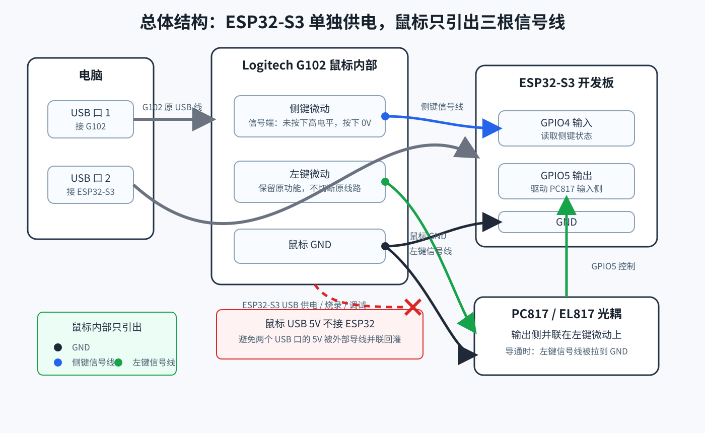

## 2. 推荐硬件方案

最终推荐方案：

```text
ESP32-S3 独立 USB 供电
鼠标内部引出 GND、侧键信号、左键信号
侧键信号通过电阻接入 ESP32 输入 GPIO
左键信号通过 PC817 光耦输出侧模拟短接到 GND
```

核心元件：

```text
PC817 / EL817，DIP-4 直插光耦 x1
470Ω，1/4W 直插金属膜电阻 x1
330Ω，1/4W 直插金属膜电阻 x1，备用
47kΩ，1/4W 直插金属膜电阻 x1
100kΩ，1/4W 直插金属膜电阻 x1
2.54mm 单面独立焊盘洞洞板 x1
30AWG 多股特氟龙线若干，建议黑/蓝/绿/黄或橙四色
1mm、2mm、3mm 热缩管若干
```

可选元件：

```text
220kΩ，1/4W 直插金属膜电阻 x1
330kΩ，1/4W 直插金属膜电阻 x1
```

这两个电阻用于侧键信号为 5V 时做分压保护。

### 2.1 现有硬件

你当前已经具备或已经确定使用的硬件：

| 物品 | 用途 | 说明 |
| --- | --- | --- |
| ESP32-S3-N16R8 开发板 | 主控 | 由电脑 USB 单独供电，使用 GPIO4 和 GPIO5 |
| Logitech G102 鼠标 | 被改造对象 | 鼠标原 USB 线保持连接电脑 |
| 万用表 | 查找信号线、检查短路 | 必须用于确认侧键/左键电压 |
| 电烙铁 | 焊接 | 焊鼠标引线、洞洞板模块、导线 |

本项目不需要先打嘉立创 PCB。推荐先用洞洞板做一个小模块，验证可靠后再考虑是否画 PCB。

### 2.2 需要购买的物料

建议按“必买”“5V 侧键才需要”“已有则不用买”“可选绝缘/固定”“不建议购买”几类处理。

#### 必买物料

| 物料 | 明确规格 | 推荐数量 | 搜索关键词 | 用途 |
| --- | --- | --- | --- | --- |
| 光耦 | `PC817` 或 `EL817`，`DIP-4` 直插封装，普通 CTR 档即可 | 5~10 个 | `PC817 直插 DIP-4`、`EL817 DIP4` | 模拟左键电子开关 |
| 470Ω 电阻 | `470Ω`，`1/4W`，直插，金属膜优先，`1%` 或 `5%` 均可 | 10 个 | `470欧 1/4W 直插 金属膜电阻` | GPIO5 到 PC817 1脚限流 |
| 330Ω 电阻 | `330Ω`，`1/4W`，直插，金属膜优先，备用 | 10 个 | `330欧 1/4W 直插 金属膜电阻` | PC817 驱动余量不足时替代 470Ω |
| 47kΩ 电阻 | `47kΩ`，`1/4W`，直插，金属膜优先，`1%` 或 `5%` 均可 | 10 个 | `47K 1/4W 直插 金属膜电阻` | 3.3V 侧键信号串联输入 |
| 100kΩ 电阻 | `100kΩ`，`1/4W`，直插，金属膜优先，`1%` 或 `5%` 均可 | 10 个 | `100K 1/4W 直插 金属膜电阻` | GPIO5 下拉，防止上电误触发 |
| 洞洞板 / 万能板 | `2.54mm` 间距，单面独立焊盘，非连孔板，厚度约 `1.2~1.6mm` | 1~3 块 | `2.54 洞洞板 独立焊盘 单面` | 焊 PC817 和电阻 |
| 特氟龙线 | `30AWG`，PTFE/FEP 外皮，多股软线优先，镀银铜或镀锡铜均可，耐温约 `200℃`，单色即可 | 1~3 米 | `30AWG 特氟龙线 多股`、`30AWG PTFE 镀银铜线` | 鼠标内部引线和模块飞线 |

#### 侧键信号为 5V 时才需要

| 物料 | 明确规格 | 推荐数量 | 搜索关键词 | 用途 |
| --- | --- | --- | --- | --- |
| 220kΩ 电阻 | `220kΩ`，`1/4W`，直插，金属膜优先，`1%` 或 `5%` 均可 | 10 个 | `220K 1/4W 直插 金属膜电阻` | 5V 侧键信号分压上臂 |
| 330kΩ 电阻 | `330kΩ`，`1/4W`，直插，金属膜优先，`1%` 或 `5%` 均可 | 10 个 | `330K 1/4W 直插 金属膜电阻` | 5V 侧键信号分压下臂 |

如果万用表测到侧键未按下为约 3.3V，就不需要使用 220kΩ 和 330kΩ。

#### 线材规格选择

最推荐只买一种规格：

```text
30AWG 多股特氟龙线
```

原因：

- 比普通 PVC 线更耐烙铁温度，不容易一烫就缩皮。
- 比 24AWG、26AWG 更细，更适合鼠标内部走线。
- 比 32AWG 更容易剥线和焊接。
- 多股线比单芯线更耐弯折，适合鼠标线材附近的活动环境。

可选范围：

| 规格 | 是否推荐 | 说明 |
| --- | --- | --- |
| 28AWG | 可用 | 更结实，但稍粗，鼠标内部走线不如 30AWG 舒服 |
| 30AWG | 最推荐 | 体积、强度、焊接难度最均衡 |
| 32AWG | 可用但不优先 | 更细，但更难剥线，焊接时更容易断 |

多色线不是必须。只买一种颜色也可以，但必须在每根线两端做标记。

推荐标记方式：

```text
GND：标记为 GND
侧键信号：标记为 SIDE
左键信号：标记为 LEFT
GPIO5 驱动：标记为 GPIO5
```

可以用纸胶带、标签纸、记号笔、不同数量的小结，或不同颜色的小段胶带/热缩管标注。

如果购买多色线，推荐颜色：

```text
黑色：GND
蓝色：侧键信号 / GPIO4
绿色：左键信号
黄色或橙色：GPIO5 驱动 PC817
```

无论用单色还是多色，都建议线的两端都标，不要只标一端。

#### 已有则不用重复购买

| 物料 | 说明 |
| --- | --- |
| 松香 / 助焊剂 | 你已经有松香就可以，不需要重复购买 |
| 吸锡带 | 你已经有就可以，用于焊错或连锡时修正 |
| 电烙铁 / 焊锡丝 / 万用表 | 已有即可，不列入采购清单 |

#### 可选绝缘和固定材料

| 物料 | 是否必须 | 说明 |
| --- | --- | --- |
| 热缩管 | 非必须，但推荐 | 线身已有外皮，但焊点、线头、电阻脚和 PC817 引脚仍需要绝缘 |
| Kapton 高温胶带 | 可替代热缩管 | 适合覆盖洞洞板背面焊点或鼠标 PCB 附近裸露点 |
| 绝缘胶带 | 可替代热缩管 | 可用，但长期可靠性不如热缩管和 Kapton 胶带 |
| 热熔胶 / UV 胶 | 推荐用于固定 | 防止线材拉扯鼠标 PCB 焊盘，也可覆盖裸露焊点 |
| 小塑料盒 | 推荐用于最终成品 | 保护 ESP32-S3 和洞洞板模块 |

关于热缩管：

```text
可以不买，但不能不做绝缘。
30AWG 特氟龙线只保护线身，不保护焊点和剥线处。
```

#### 不建议购买的物料

| 物料 | 原因 |
| --- | --- |
| 普通 PC817 光耦模块 | 多数模块带电源端、上拉、电平输出，不一定能当鼠标按键干接点 |
| 22AWG / 24AWG 粗线 | 鼠标内部不好走线，容易顶住外壳或拉坏焊盘 |
| 面包板跳线作为最终线材 | 接触不牢，体积大，不适合装进外壳 |
| 连孔洞洞板 / 条形板 | 容易误短接，不如独立焊盘板直观 |
| 贴片 PC817 | 太小，不适合新手手焊 |

#### 建议多买

| 物料 | 原因 |
| --- | --- |
| PC817 多买几个 | 便宜，焊坏或剪脚太短时可以替换 |
| 电阻每种多买几个 | 直插电阻通常按包卖，多买方便试错 |
| 洞洞板多买几块 | 第一块可能会裁坏或布局不满意 |
| 特氟龙线多买一点 | 单色线也可以，多留余量方便返工和重新标注 |

#### 其他可选物料

| 物料 | 是否推荐 | 说明 |
| --- | --- | --- |
| 尖头镊子 | 推荐 | 夹电阻脚、细线、胶带、热缩管 |
| 扎带 | 可选 | 辅助固定线束 |
| 2.54mm 排针 / 排母 | 可选 | 想做可插拔连接时使用；最终成品直接焊线更牢 |
| DIP-4 IC 座 | 可选 | 可插拔 PC817，但会增加体积 |

不建议直接购买普通“PC817 光耦模块”替代本项目中的裸 PC817。很多现成模块自带上拉、电源端和输出电路，不一定能当作鼠标左键的简单开关使用。除非模块明确引出 `C` 和 `E`，否则优先买裸的 DIP-4 PC817。

### 2.3 洞洞板模块结构

洞洞板只承载 PC817 和几个电阻，不需要把 ESP32-S3 开发板整块焊到洞洞板上。

推荐结构：

```text
鼠标内部 3 根线
GND / 侧键信号 / 左键信号
        ↓
小洞洞板模块
PC817 + 470Ω + 47kΩ + 100kΩ
        ↓
ESP32-S3 开发板
GND / GPIO4 / GPIO5
```

模块连接总览：

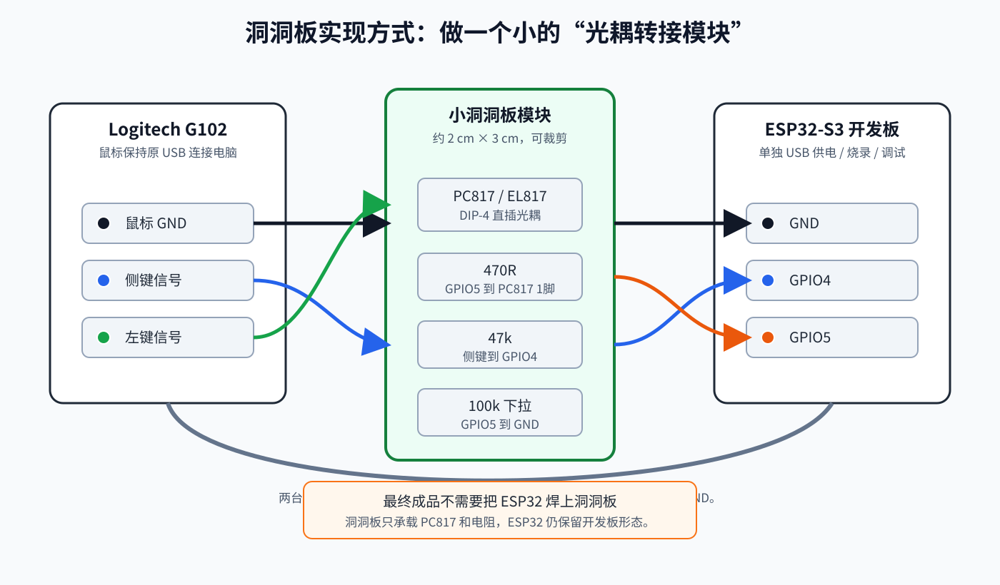


### 2.4 3.3V 侧键信号的洞洞板布局示例

如果测量结果是：

```text
侧键未按下：约 3.3V
侧键按下：约 0V
左键未按下：约 3.3V
左键按下：约 0V
```

可以按下面的洞洞板布局焊接。

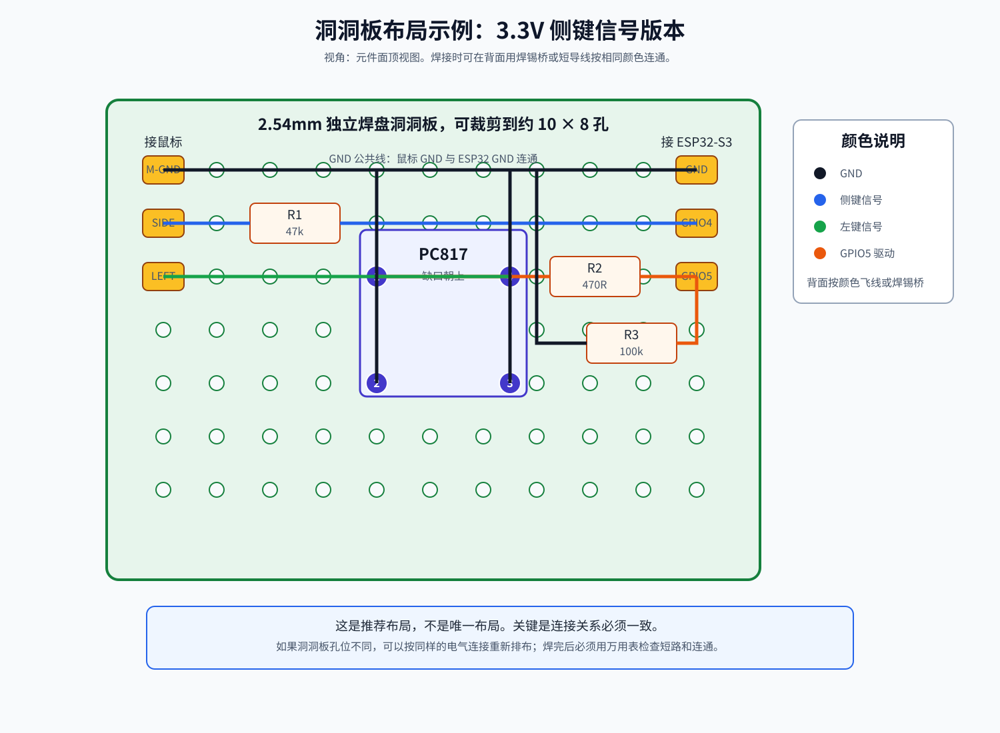

这个布局中：

| 标号 | 元件 | 连接 |
| --- | --- | --- |
| R1 | 47kΩ | 鼠标侧键信号 `SIDE` 到 ESP32 `GPIO4` |
| R2 | 470Ω | ESP32 `GPIO5` 到 PC817 1脚 |
| R3 | 100kΩ | ESP32 `GPIO5` 到 GND |
| PC817 1脚 | 输入 LED 正极 | 通过 R2 接 GPIO5 |
| PC817 2脚 | 输入 LED 负极 | 接 ESP32 GND |
| PC817 3脚 | 输出发射极 E | 接鼠标 GND |
| PC817 4脚 | 输出集电极 C | 接鼠标左键信号 `LEFT` |

洞洞板两侧建议预留 6 个焊盘作为外部接线点：

| 方向 | 焊盘 | 接到哪里 |
| --- | --- | --- |
| 鼠标侧 | `M-GND` | 鼠标 GND |
| 鼠标侧 | `SIDE` | 鼠标侧键信号线 |
| 鼠标侧 | `LEFT` | 鼠标左键信号线 |
| ESP32 侧 | `GND` | ESP32 GND |
| ESP32 侧 | `GPIO4` | ESP32 GPIO4 |
| ESP32 侧 | `GPIO5` | ESP32 GPIO5 |

其中 `M-GND` 和 `ESP32 GND` 必须连通。

### 2.5 5V 侧键信号时的洞洞板替换方式

如果测量结果是：

```text
侧键未按下：约 5V
侧键按下：约 0V
```

不要让侧键信号直接进入 ESP32-S3 GPIO。此时只替换侧键输入部分，PC817 左键模拟部分不变。

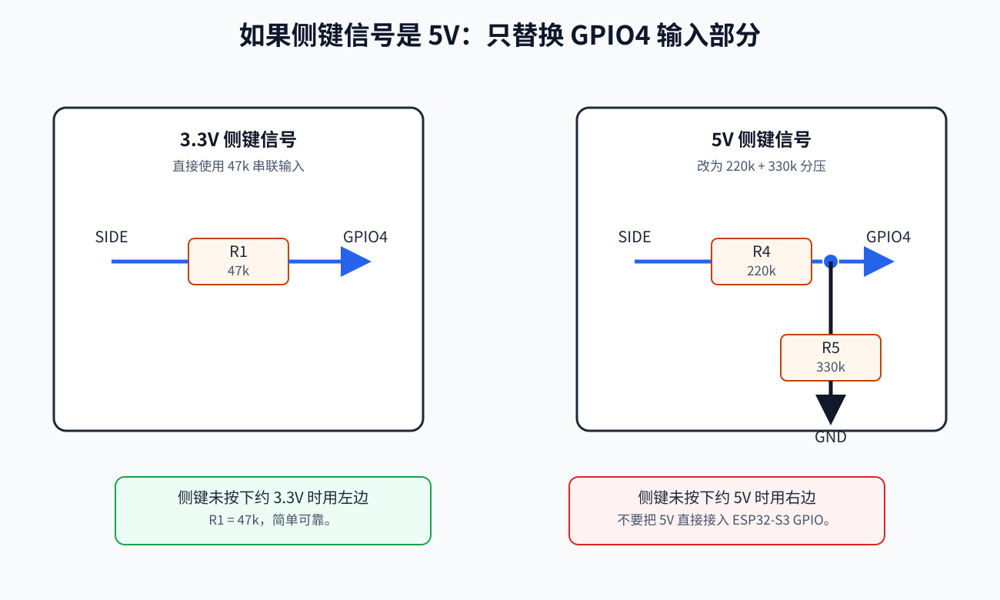

替换关系：

```text
3.3V 版本：
SIDE ---- 47kΩ ---- GPIO4

5V 版本：
SIDE ---- 220kΩ ----+---- GPIO4
                   |
                  330kΩ
                   |
                  GND
```

5V 分压后 GPIO4 看到的电压约为：

```text
5V * 330kΩ / (220kΩ + 330kΩ) ≈ 3.0V
```

### 2.6 洞洞板焊接顺序建议

推荐按下面顺序焊：

1. 先裁剪洞洞板，保留大约 `10 × 8` 个孔位。
2. 放入 PC817，确认缺口方向，先只焊两个对角脚固定。
3. 焊 R2 `470Ω`，连接 GPIO5 到 PC817 1脚。
4. 焊 R3 `100kΩ`，连接 GPIO5 到 GND。
5. 焊 R1 `47kΩ`；如果侧键是 5V，则改焊 `220kΩ + 330kΩ` 分压。
6. 焊接鼠标侧三根线：`M-GND`、`SIDE`、`LEFT`。
7. 焊接 ESP32 侧三根线：`GND`、`GPIO4`、`GPIO5`。
8. 用万用表蜂鸣档检查 GND 是否连通、相邻焊点是否短路。
9. 确认无误后再套热缩管或装入小外壳。

焊接时不要急着封装。先裸板测试，确认侧键检测和左键模拟都正常，再做热缩管、胶固定和外壳收纳。

## 3. 为什么选择 PC817 光耦

常见方案有三种：

```text
1. ESP32 GPIO 直接接鼠标按键信号
2. NMOS / 三极管模拟按键
3. PC817 光耦模拟按键
```

不推荐 GPIO 直接接左键信号。

原因：

- 鼠标按键信号属于鼠标主控 MCU 的输入扫描电路。
- ESP32 GPIO 直接接入可能产生电平冲突。
- ESP32-S3 GPIO 不耐 5V。
- 上电、复位、烧录期间 GPIO 状态不可完全预测。

NMOS 方案也可行，但需要正确区分 G、D、S，并理解开漏输出。对不熟悉 MOS 管的人来说，接错概率较高。

PC817 更直观：

```text
ESP32 这一侧：点亮一个内部 LED
鼠标这一侧：一个光控三极管导通
```

可以把 PC817 理解为：

```text
ESP32 控制的电子按键
```

在本项目里，PC817 输出侧并联在鼠标左键微动上。ESP32 控制 PC817 导通时，鼠标左键信号被拉到 GND，鼠标主控认为左键被按下。

## 4. 系统结构

整体上可以把系统分成四个部分：

| 模块 | 做什么 | 和谁相连 | 注意点 |
| --- | --- | --- | --- |
| G102 原鼠标电路 | 继续负责 USB 鼠标通信、移动、原按键扫描 | 电脑 USB、鼠标内部微动、洞洞板信号线 | 原 USB 线不改，不切断原左键 |
| 侧键输入通道 | 把侧键是否按下送给 ESP32 | `SIDE -> GPIO4` | ESP32 只读这个信号，不主动输出 |
| ESP32-S3 控制器 | 根据侧键状态生成点击节奏 | `GPIO4` 输入、`GPIO5` 输出、独立 USB | 固件决定点击间隔和按下持续时间 |
| PC817 左键模拟通道 | 把 ESP32 输出转换成鼠标左键闭合 | `GPIO5 -> PC817 -> LEFT/GND` | 输出侧并联在原左键微动上 |

本方案故意把“读取侧键”和“模拟左键”分成两条不同通道：

```text
输入通道：鼠标 SIDE  -> ESP32 GPIO4
输出通道：ESP32 GPIO5 -> PC817 -> 鼠标 LEFT
```

这样做的好处是调试清晰：

- 如果侧键触发不了，优先检查 `SIDE`、`GPIO4`、共地和分压。
- 如果侧键能触发但左键不点击，优先检查 `GPIO5`、`470Ω`、`PC817`、`LEFT`。
- 如果鼠标本身异常，优先检查鼠标 `5V/GND` 是否短路、飞线是否压到机构、`LEFT` 是否永久短到 GND。

### 4.1 总体结构

```text
                        ┌──────────────────────────┐
电脑 USB 口 1 ─────────>│ Logitech G102 鼠标        │
                        │                          │
                        │  侧键微动 ── 侧键信号 ─────┼─────┐
                        │                          │     │
                        │  左键微动 ── 左键信号 ─────┼──┐  │
                        │                          │  │  │
                        │  GND ─────────────────────┼──┼──┘
                        └──────────────────────────┘  │
                                                      │
                                                      │
                        ┌──────────────────────────┐  │
电脑 USB 口 2 ─────────>│ ESP32-S3 开发板           │  │
                        │                          │  │
                        │ GPIO4 <── 侧键信号        │  │
                        │ GPIO5 ──> PC817 输入侧    │  │
                        │ GND   <── 鼠标 GND        │  │
                        └──────────────────────────┘  │
                                                      │
                        ┌──────────────────────────┐  │
                        │ PC817 光耦                │  │
                        │                          │  │
                        │ 输出侧并联模拟左键短接     │<─┘
                        └──────────────────────────┘
```

### 4.2 鼠标内部引线

从 G102 内部引出三根线：

| 线名 | 来源 | 作用 |
| --- | --- | --- |
| 鼠标 GND | 鼠标 USB 黑线或鼠标 PCB GND | 给 ESP32 读取鼠标按键信号提供参考地 |
| 侧键信号线 | 侧键微动的信号端 | ESP32 用于判断侧键是否按下 |
| 左键信号线 | 左键微动的信号端 | PC817 输出侧用于模拟左键按下 |

不要引出鼠标 USB 5V 给 ESP32。

这三根线的角色不同：

```text
鼠标 GND：公共参考点，让 ESP32 能看懂 SIDE 的高低电平
SIDE：输入信号，告诉 ESP32 侧键有没有被按下
LEFT：输出控制目标，被 PC817 拉低时等效于左键按下
```

`SIDE` 和 `LEFT` 不要接反。接反后常见现象是：按侧键没有反应、左键异常、或者 ESP32 一输出就影响到错误按键。

## 5. 标准接线图

### 5.1 3.3V 侧键信号版本

如果万用表测到侧键未按下时为约 3.3V，按下后为 0V，使用下面接线。

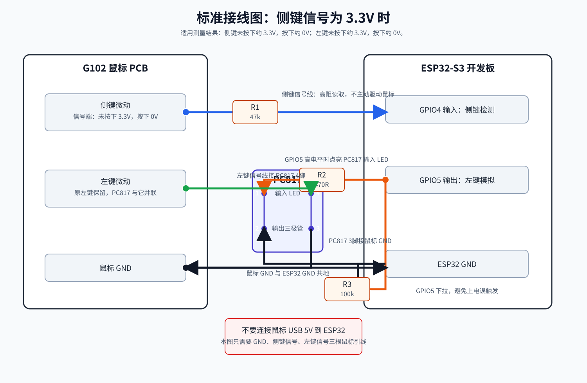

```text
鼠标 GND ----------------------------- ESP32 GND

鼠标侧键信号线 ---- 47kΩ ---- ESP32 GPIO4


ESP32 GPIO5 ---- 470Ω ---- PC817 1脚
ESP32 GND  ---------------- PC817 2脚

鼠标左键信号线 -------------- PC817 4脚
鼠标 GND -------------------- PC817 3脚

ESP32 GPIO5 ---- 100kΩ ---- ESP32 GND
```

### 5.2 5V 侧键信号版本

如果万用表测到侧键未按下时为约 5V，按下后为 0V，ESP32 GPIO 不能直接读取 5V，需要分压。

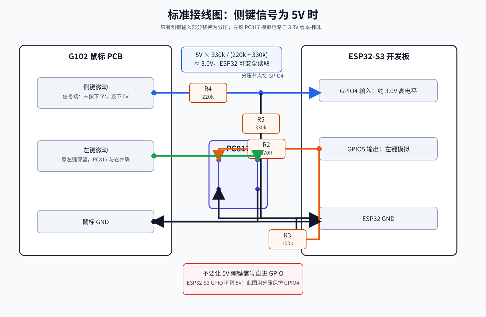

```text
鼠标 GND ----------------------------- ESP32 GND

鼠标侧键信号线 ---- 220kΩ ----+---- ESP32 GPIO4
                              |
                             330kΩ
                              |
                             GND


ESP32 GPIO5 ---- 470Ω ---- PC817 1脚
ESP32 GND  ---------------- PC817 2脚

鼠标左键信号线 -------------- PC817 4脚
鼠标 GND -------------------- PC817 3脚

ESP32 GPIO5 ---- 100kΩ ---- ESP32 GND
```

分压计算：

```text
GPIO4 电压 = 5V * 330kΩ / (220kΩ + 330kΩ)
           = 5V * 0.6
           = 3.0V
```

3.0V 对 ESP32-S3 来说可以作为高电平读取，同时低于 GPIO 的安全范围。

## 6. PC817 引脚说明

常见 DIP-4 封装 PC817 顶视图：

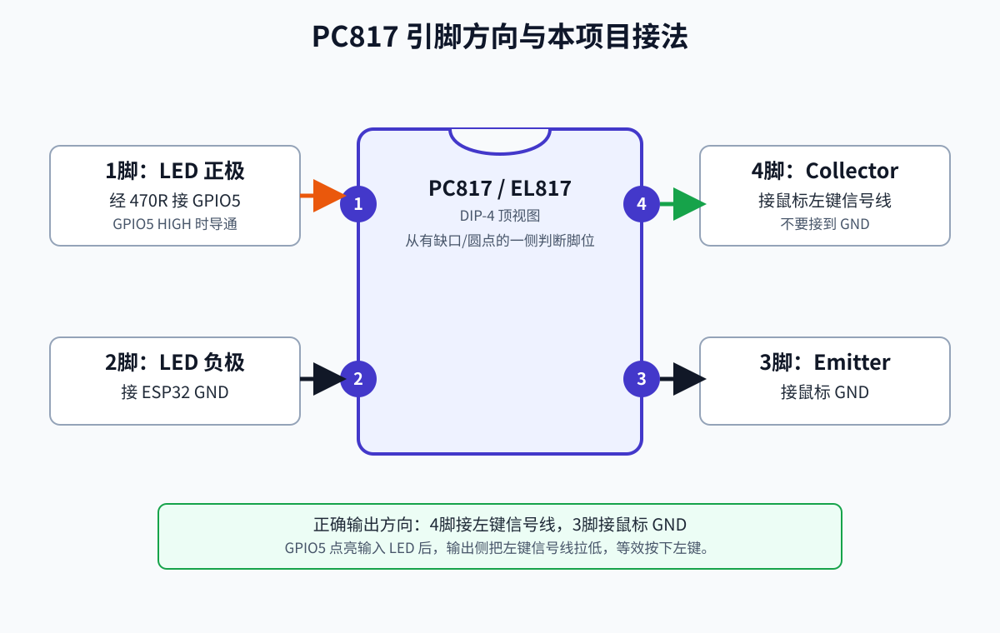

```text
        缺口 / 圆点
          ┌───────┐
  1脚  ───┤       ├─── 4脚
          │ PC817 │
  2脚  ───┤       ├─── 3脚
          └───────┘

1脚：内部 LED 正极 Anode
2脚：内部 LED 负极 Cathode
3脚：输出三极管发射极 Emitter
4脚：输出三极管集电极 Collector
```

本项目连接方式：

```text
1脚 -> 通过 470Ω 接 ESP32 GPIO5
2脚 -> 接 ESP32 GND
3脚 -> 接鼠标 GND
4脚 -> 接鼠标左键信号线
```

PC817 输出侧方向不要接反。

正确方向是：

```text
Collector 4脚 -> 左键信号线
Emitter   3脚 -> 鼠标 GND
```

这样 PC817 导通时，左键信号会被拉低到 GND，等效于左键微动闭合。

## 7. ESP32-S3 GPIO 分配

推荐使用：

| 功能 | GPIO | 方向 | 说明 |
| --- | --- | --- | --- |
| 侧键检测 | GPIO4 | 输入 | 读取鼠标侧键信号 |
| 左键模拟 | GPIO5 | 输出 | 控制 PC817 输入侧 |

GPIO5 增加 100kΩ 下拉：

```text
GPIO5 ---- 100kΩ ---- GND
```

作用：

- ESP32 上电复位时，GPIO 可能短时间处于高阻态。
- 下拉电阻可以避免 PC817 输入侧误导通。
- 减少上电瞬间误触发左键的概率。

不建议使用以下类型的 GPIO：

```text
启动绑带脚
下载模式相关脚
只输入脚
开发板上已经连接特殊外设的脚
```

不同 ESP32-S3 开发板的引脚设计不同，最终以你手上开发板的原理图为准。

## 8. 鼠标按键电路原理

大多数鼠标按键采用低电平触发。

所谓低电平触发，可以理解成鼠标主控一直在看某根按键信号线：

```text
信号线是高电平 -> 按键没按
信号线是 0V    -> 按键按下
```

这个高电平通常不是按键自己产生的，而是鼠标主控内部或外部上拉电阻把信号线“轻轻拉高”。微动开关闭合时，信号线被更强地接到 GND，于是电压变成 0V。

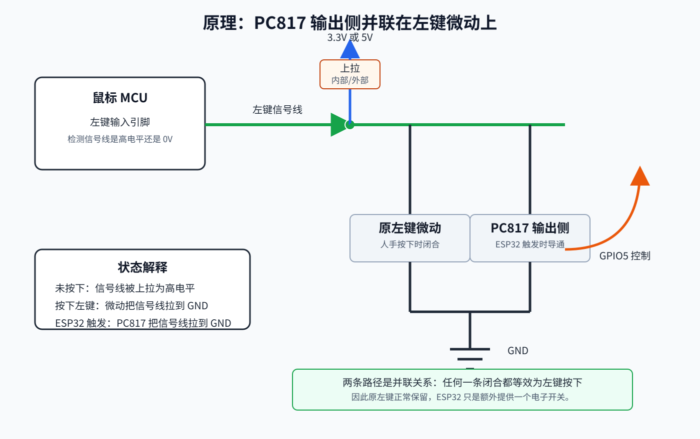

未按下时：

```text
鼠标 MCU 内部或外部上拉
信号线 = 高电平
常见为 3.3V
```

按下时：

```text
微动开关闭合
信号线被短接到 GND
信号线 = 0V
```

可以抽象为：

```text
             上拉电阻
               │
               │
鼠标 MCU 输入 ──┴──── 左键信号线
                    │
                    │
                 左键微动
                    │
                   GND
```

本项目把 PC817 输出侧并联到左键微动上：

```text
             上拉电阻
               │
               │
鼠标 MCU 输入 ──┴──── 左键信号线
                    │
                    ├──── 左键微动 ─── GND
                    │
                    └──── PC817 输出 ─ GND
```

所以有两种方式能让鼠标认为左键按下：

```text
1. 人手按下原来的左键微动
2. ESP32 让 PC817 输出侧导通
```

两者是并联关系，不会破坏原左键功能。

### 8.1 侧键输入通道原理

侧键输入通道只负责让 ESP32 知道侧键状态，不负责改变鼠标状态。

常见 `3.3V` 侧键信号版本：

```text
鼠标 SIDE ---- 47kΩ ---- ESP32 GPIO4
鼠标 GND  ---------------- ESP32 GND
```

侧键未按下时：

```text
SIDE ≈ 3.3V
GPIO4 读到 HIGH
固件判断：侧键未按下
```

侧键按下时：

```text
SIDE ≈ 0V
GPIO4 读到 LOW
固件判断：侧键按下，开始连点逻辑
```

`47kΩ` 的作用不是分压，而是限流和隔离。它让 ESP32 以高阻方式“旁路监听”鼠标侧键信号，即使固件配置错误或上电瞬间 GPIO 状态不稳定，也能降低对鼠标原电路的影响。

如果实测 `SIDE` 未按下是约 `5V`，就不能直接接 ESP32 GPIO。此时使用 `220kΩ + 330kΩ` 分压：

```text
SIDE ---- 220kΩ ----+---- GPIO4
                    |
                  330kΩ
                    |
                   GND
```

分压后的高电平约为：

```text
5V * 330kΩ / (220kΩ + 330kΩ) ≈ 3.0V
```

这样 GPIO4 能读到稳定高电平，同时不会承受 5V。

### 8.2 左键模拟通道原理

左键模拟通道负责把 ESP32 的输出变成鼠标能识别的“左键按下”。

ESP32 不能直接把 `LEFT` 拉到 GND，原因是鼠标按键线属于鼠标主控电路，电压和上电时序不一定与 ESP32 完全一致。这里用 `PC817` 做中间电子开关。

PC817 内部可以粗略看成两边：

```text
输入侧：一个 LED，由 ESP32 GPIO5 点亮
输出侧：一个光控三极管，接在 LEFT 和鼠标 GND 之间
```

GPIO5 为低电平时：

```text
PC817 输入 LED 不亮
PC817 输出侧不导通
LEFT 由鼠标电路保持高电平
鼠标认为左键松开
```

GPIO5 为高电平时：

```text
电流从 GPIO5 -> 470Ω -> PC817 1脚 -> PC817 2脚 -> ESP32 GND
PC817 输入 LED 点亮
PC817 输出侧 4脚和3脚导通
LEFT -> PC817 4脚 -> PC817 3脚 -> 鼠标 GND
LEFT 被拉到 0V
鼠标认为左键按下
```

其中 `470Ω` 是 PC817 输入 LED 的限流电阻。没有它，GPIO5 直接驱动 LED 会产生过大电流。

`100kΩ` 下拉接在 `GPIO5 -> GND`，作用是让 ESP32 上电、复位、烧录期间 GPIO5 默认偏向低电平，降低误触发左键的概率：

```text
ESP32 GPIO5 ---- 100kΩ ---- ESP32 GND
```

### 8.3 为什么需要共地，但不接 5V

本方案里有两个 USB 供电设备：

```text
电脑 USB 口 1 -> G102 鼠标
电脑 USB 口 2 -> ESP32-S3
```

两边的 `5V` 不相连，因为直接并联两个 USB 口的 5V 可能产生回灌风险。

但两边的 `GND` 必须相连，原因是 ESP32 要读取 `SIDE`：

```text
电压 = 信号点相对于参考地的电位差
```

如果 ESP32 GND 没有和鼠标 GND 相连，GPIO4 看到的电压就没有可靠参考，可能表现为乱跳、读不到侧键、或者误触发。

所以最终边界是：

```text
可以连接：鼠标 GND -> ESP32 GND
不要连接：鼠标 5V  -> ESP32 5V/VIN
```

### 8.4 G102 拆解资料核对结论

在购买物料前，已经查阅过罗技 G102 的公开拆解/改造资料。外设堂的 G102 拆解文章中提到：

```text
微动第一脚都是地，板子大面积铺铜接地
```

这与本项目的核心假设一致：

```text
鼠标微动一端接 GND
另一端为按键信号线
按下微动时，信号线被短接到 GND
```

因此，从理论和公开拆解资料看，G102 的左键适合使用本项目的 PC817 并联模拟方案：

```text
原左键微动：左键信号线 -> GND
PC817 输出：左键信号线 -> GND
```

侧键通常也采用同类低电平触发结构，ESP32 通过高阻方式读取侧键信号，理论上不会明显干扰鼠标原电路。

需要注意：

- G102 存在不同版本和不同批次，例如 Prodigy / Lightsync，PCB 细节可能变化。
- 公开拆解资料只能作为购买物料前的理论确认，不能替代你手上鼠标的实测。
- 最终焊接前仍必须用万用表确认左键和侧键的电压变化。

最终可执行判断：

```text
如果实测：
左键未按下：约 3.3V 或 5V
左键按下：0V
侧键未按下：约 3.3V 或 5V
侧键按下：0V

则当前 PC817 + 洞洞板方案可以使用。
```

## 9. 为什么不接鼠标 5V

本方案中 ESP32-S3 由电脑另一个 USB 口供电。

因此不要连接：

```text
鼠标 USB 5V -> ESP32 5V/VIN
```

原因：

- 鼠标和 ESP32 分别接在电脑不同 USB 口上。
- 两个 USB 口的 5V 不应该被外部导线直接并联。
- 直接并联可能产生回灌电流。
- 回灌可能导致设备异常、USB 口保护动作，极端情况下有损坏风险。

本方案只共地：

```text
鼠标 GND -> ESP32 GND
```

共地的目的：

- ESP32 需要以同一个参考地读取侧键信号。
- PC817 输入侧由 ESP32 控制，输出侧由鼠标电路识别。
- 不连接 5V，只连接 GND 和信号，风险更低。

## 10. 万用表确认步骤

下面的图示展示了查找按键信号端的基本方法：黑表笔接鼠标 GND，红表笔测微动焊点，寻找“未按下为高电平、按下为 0V”的焊点。

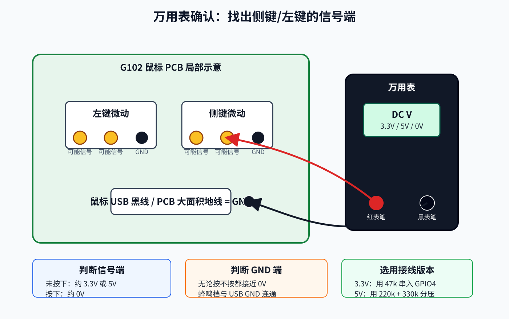

### 10.1 找鼠标 GND

方法一：

```text
鼠标 USB 黑线通常是 GND
```

方法二：

```text
万用表蜂鸣档
USB 插头金属外壳 / USB GND -> PCB 大面积地线
蜂鸣说明是 GND
```

### 10.2 找左键信号线

鼠标插电脑，保持通电。

万用表设置为直流电压档。

```text
黑表笔 -> 鼠标 GND
红表笔 -> 左键微动各个焊点逐个测量
```

寻找这样的焊点：

```text
左键未按下：约 3.3V 或 5V
左键按下：约 0V
```

这个焊点就是左键信号线。

如果某个焊点一直是 0V，它通常是 GND，不是信号线。

### 10.3 找侧键信号线

同样方法测侧键微动。

寻找：

```text
侧键未按下：约 3.3V 或 5V
侧键按下：约 0V
```

这个焊点就是侧键信号线。

### 10.4 判断侧键信号接法

如果侧键信号未按下为 3.3V：

```text
侧键信号线 ---- 47kΩ ---- ESP32 GPIO4
```

如果侧键信号未按下为 5V：

```text
侧键信号线 ---- 220kΩ ----+---- ESP32 GPIO4
                          |
                         330kΩ
                          |
                         GND
```

不要让 5V 信号直接进入 ESP32-S3 GPIO。

## 11. 焊接建议

### 11.1 线材

推荐：

```text
极细硅胶线
特氟龙线
漆包线
```

线越细，越容易沿鼠标内部结构走线，也不容易影响外壳闭合。

### 11.2 走线

建议从鼠标原 USB 线出口附近引出。

外部可以使用：

```text
热缩管
蛇皮编织网
细扎带
```

把引出的三根线和鼠标原 USB 线固定在一起。

### 11.3 固定

焊点完成后建议使用：

```text
少量热熔胶
UV 胶
绝缘胶带
热缩管
```

目的：

- 防止焊点受力脱落。
- 防止裸露导线短路。
- 防止鼠标移动时线材拉扯 PCB 焊盘。

### 11.4 外部盒子

ESP32-S3 和 PC817 小板建议放在鼠标线中段或靠近 USB 插头的位置。

可以使用：

```text
小塑料盒
3D 打印外壳
热缩管包裹的小模块
```

不建议让 ESP32-S3 裸板长期悬空使用。

## 12. 首次通电检查

### 12.1 断电状态检查

鼠标和 ESP32 都不要连接电脑。

用万用表蜂鸣档检查：

```text
鼠标 5V 与 GND 是否短路：不应蜂鸣
ESP32 5V 与 GND 是否短路：不应蜂鸣
鼠标左键信号与 GND 是否永久短路：不应永久蜂鸣
鼠标侧键信号与 GND 是否永久短路：不应永久蜂鸣
```

按下对应微动时，信号线与 GND 蜂鸣是正常的。

### 12.2 只插鼠标测试

先只插 G102，不插 ESP32。

确认：

```text
鼠标能被电脑识别
左键正常
右键正常
侧键状态符合预期
光标移动正常
```

### 12.3 插 ESP32 但不运行连点逻辑

再插 ESP32-S3。

固件未启用左键输出前，确认：

```text
鼠标不会自动点击
左键仍然正常
侧键不会导致异常
```

### 12.4 手动测试 PC817 输出

后续固件中可以先做一个低频测试：

```text
每 2 秒模拟点击一次
```

确认鼠标左键能被电脑识别后，再实现 55 ms 附近的连续点击逻辑。

## 13. 点击行为与硬件关系

本硬件只支持两种输出状态：

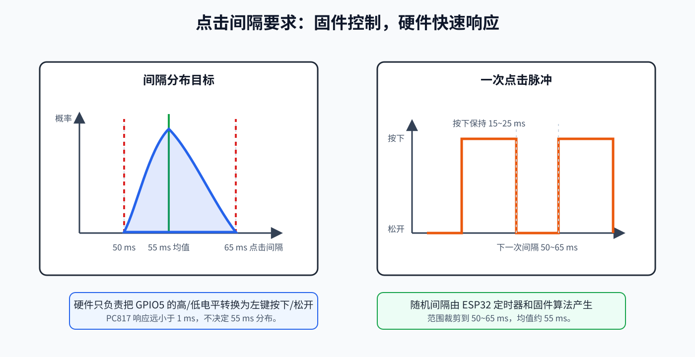

```text
PC817 关闭 -> 鼠标左键松开
PC817 导通 -> 鼠标左键按下
```

一次完整点击包含：

```text
按下
保持一小段时间
松开
等待下一次
```

例如后续固件可以控制：

```text
左键按下持续 15~25 ms
两次点击之间的间隔在 50~65 ms 内变化
平均约 55 ms
分布近似正态
```

PC817 的响应速度远小于 1 ms，对 50~65 ms 的点击间隔没有明显影响。

## 14. 关于同时按左键和侧键

本项目暂不加入额外保护。

硬件上，原左键微动和 PC817 输出侧是并联关系：

```text
左键信号线 ──┬── 原左键微动 ── GND
              │
              └── PC817 输出 ── GND
```

如果物理左键和 ESP32 模拟左键同时触发，本质上只是两个开关同时把同一根左键信号线拉到 GND。

在低电平触发鼠标按键电路中，这通常不会造成电气冲突。

需要注意的是：

- 同时触发时，电脑看到的是左键处于按下状态。
- 如果 ESP32 还在连点，实际点击节奏会受到物理左键按住状态影响。
- 由于你明确不会同时使用，当前硬件不额外读取物理左键状态。

如果后续想加入软件保护，可以再把左键信号通过高阻电阻接入 ESP32 另一个输入 GPIO。

## 15. 常见故障排查

### 15.1 插上后鼠标一直左键按下

可能原因：

```text
PC817 3脚和4脚接反
GPIO5 上电悬空导致误触发
GPIO5 固件默认输出高电平
左键信号线焊接短路到 GND
焊锡连桥
```

检查：

```text
确认 GPIO5 有 100kΩ 下拉
确认 PC817 4脚接左键信号线
确认 PC817 3脚接鼠标 GND
断电后测左键信号线到 GND 是否永久短路
```

### 15.2 ESP32 检测不到侧键

可能原因：

```text
侧键信号线找错
GPIO4 没有和鼠标共地
侧键信号是 5V 但分压接错
侧键不是低电平触发
固件输入模式配置不正确
```

检查：

```text
黑表笔接鼠标 GND，红表笔测侧键信号
确认未按下和按下时电压有明显变化
确认 ESP32 GND 与鼠标 GND 连通
```

### 15.3 ESP32 输出了，但鼠标没有点击

可能原因：

```text
PC817 输入侧接反
PC817 输出侧接反
470Ω 电阻位置错误
左键信号线找错
GPIO5 实际没有输出高电平
```

检查：

```text
GPIO5 输出高电平时，PC817 1脚相对2脚应有约 1.0~1.3V LED 压降
PC817 导通时，左键信号线应被拉到接近 0V
```

### 15.4 鼠标功能异常或断连

可能原因：

```text
鼠标内部短路
焊接时损伤 PCB
线材压住鼠标内部结构
鼠标 USB 线被拉扯
鼠标 5V 被错误连接到 ESP32
```

处理：

```text
立即断电
检查鼠标 5V/GND 是否短路
检查焊点是否连锡
确认没有连接鼠标 5V 到 ESP32
```

## 16. 硬件连接清单

最终 3.3V 侧键信号版本：

| 连接 | 元件 | 说明 |
| --- | --- | --- |
| 鼠标 GND -> ESP32 GND | 导线 | 共地，用于侧键读取 |
| 鼠标侧键信号 -> ESP32 GPIO4 | 串联 47kΩ | 读取侧键状态 |
| ESP32 GPIO5 -> PC817 1脚 | 串联 470Ω | 驱动 PC817 输入 LED |
| ESP32 GND -> PC817 2脚 | 导线 | PC817 输入侧回路 |
| 鼠标左键信号 -> PC817 4脚 | 导线 | 输出侧集电极 |
| 鼠标 GND -> PC817 3脚 | 导线 | 输出侧发射极 |
| ESP32 GPIO5 -> ESP32 GND | 100kΩ | 上电下拉，防止误触发 |

5V 侧键信号版本只替换侧键输入部分：

| 连接 | 元件 | 说明 |
| --- | --- | --- |
| 鼠标侧键信号 -> ESP32 GPIO4 | 220kΩ + 330kΩ 分压 | 将 5V 降到约 3.0V |

## 17. 最终推荐接线

如果测量结果符合常见情况：

```text
左键未按下：3.3V
左键按下：0V
侧键未按下：3.3V
侧键按下：0V
```

则使用最终接线：

```text
鼠标 GND ----------------------------- ESP32 GND

鼠标侧键信号线 ---- 47kΩ ---- ESP32 GPIO4

ESP32 GPIO5 ---- 470Ω ---- PC817 1脚
ESP32 GND  ---------------- PC817 2脚

鼠标左键信号线 -------------- PC817 4脚
鼠标 GND -------------------- PC817 3脚

ESP32 GPIO5 ---- 100kΩ ---- ESP32 GND
```

## 18. 后续固件约束

虽然本 README 不实现代码，但硬件对固件有以下约束：

### 18.1 GPIO4 侧键输入

在低电平触发鼠标按键中：

```text
GPIO4 高电平 -> 侧键未按下
GPIO4 低电平 -> 侧键按下
```

固件需要做输入防抖。

推荐防抖时间：

```text
5~10 ms
```

### 18.2 GPIO5 左键输出

```text
GPIO5 LOW  -> PC817 关闭 -> 左键松开
GPIO5 HIGH -> PC817 导通 -> 左键按下
```

固件启动时应立即设置：

```text
GPIO5 = LOW
```

并建议上电后延迟一小段时间再启用连点逻辑：

```text
启动保护延迟：500~1000 ms
```

### 18.3 点击间隔

后续固件应保证：

```text
点击间隔最小值 >= 50 ms
点击间隔最大值 <= 65 ms
平均值约 55 ms
随机分布近似正态
```

不要在硬件上用 RC 延时实现点击间隔。ESP32 定时器比硬件 RC 更可控，也更容易调整。

## 19. 新版本 G102 扫描式兜底方案

如果手上的新版 G102 测不到 README 前面假设的稳定 `3.3V` 或 `5V` 侧键信号，不要继续强行寻找 `SIDE`。这通常说明按键不再是简单的“信号线上拉、按下短到 GND”，而可能是鼠标 MCU 用行列扫描、脉冲扫描或新版 PCB 走线方式读取按键。

这种情况下，万用表看到的不是完整波形，而是被平均后的结果，所以可能出现：

```text
未按下不是稳定 3.3V / 5V
按下前后变化不明显
读数在 0V 附近或随机跳动
不同焊点之间读数看起来都不像标准按键信号
```

此时不要让 ESP32 GPIO 直接接入鼠标扫描线。扫描线由鼠标 MCU 主动驱动，ESP32 的输入保护二极管、内部上下拉、上电高阻态和固件初始化过程都可能干扰扫描结果。最稳妥的思路是：

```text
侧键触发：从鼠标原扫描电路里独立出来，只给 ESP32 使用
左键模拟：不再假设 LEFT 必须拉到 GND，而是并联原左键微动的两个触点
```

这个方案牺牲鼠标原侧键功能，但最大化复用已经购买的配件，并且对新版扫描式 PCB 更安全。

### 19.1 现有配件复用结论

已经购买的主要配件仍然可以继续使用：

| 配件 | 是否继续使用 | 用途 |
| --- | --- | --- |
| ESP32-S3 | 使用 | 读取独立侧键，生成连点节奏 |
| PC817 / EL817 | 使用 | 模拟左键微动闭合 |
| 470Ω 电阻 | 使用 | PC817 输入 LED 限流 |
| 100kΩ 电阻 | 使用 | GPIO5 下拉，降低上电误触发概率 |
| 47kΩ 电阻 | 使用 | 侧键输入上拉或高阻输入保护 |
| 220kΩ / 330kΩ 电阻 | 暂不使用 | 只在读到真实 5V 侧键信号时才用于分压 |
| 洞洞板、30AWG 线、热缩管 | 使用 | 小模块焊接、飞线和绝缘固定 |

如果手里有多个 PC817，建议左键模拟使用两个 PC817 反向并联，兼容扫描极性不确定的情况。如果只有一个 PC817，也可以先单个测试，必要时对调输出侧 3脚和 4脚。

### 19.2 新方案总体结构

新版兜底方案不再依赖鼠标 `SIDE` 对地电压：

```text
人手按住侧键
    ↓
独立侧键微动把 ESP32 GPIO4 拉到 GND
    ↓
ESP32 固件开始输出点击节奏
    ↓
GPIO5 点亮 PC817 输入 LED
    ↓
PC817 输出侧并联闭合左键微动两个触点
    ↓
G102 原 MCU 仍然按自己的扫描方式识别“左键按下”
```

边界变化：

```text
侧键不再接鼠标 MCU 扫描线
左键不再强制接鼠标 GND
ESP32 和鼠标可以不共地
鼠标 5V 仍然不要接 ESP32 5V / VIN
```

由于左键通过 PC817 隔离模拟触点，侧键又改成 ESP32 自己的输入开关，这个方案不要求鼠标 GND 与 ESP32 GND 相连。除非后续又要读取鼠标内部某个模拟/数字信号，否则不需要共地。

### 19.3 什么时候切换到兜底方案

满足任意一种情况，就停止前面的标准方案，切换到本节：

```text
侧键未按下测不到稳定 3.3V 或 5V
侧键按下后不是明确接近 0V
侧键焊点读数跳动，万用表无法判断状态
左键或侧键任一焊点疑似由 MCU 主动扫描
新版 PCB 与公开拆解资料明显不同
```

左键部分也要单独判断：

```text
如果左键仍然满足：未按下 3.3V / 5V，按下 0V
    可以继续使用旧的 LEFT -> PC817 -> GND 拉低方案

如果左键也测不到稳定高电平
    使用本节的“PC817 并联左键微动两个触点”方案
```

### 19.4 侧键独立触发接法

目标是让侧键微动不再参与鼠标 MCU 的扫描，只作为 ESP32 的触发开关。

推荐接法：

```text
ESP32 3V3 ---- 47kΩ ----+---- ESP32 GPIO4
                        |
                    侧键微动
                        |
ESP32 GND --------------+
```

固件判断：

```text
GPIO4 = HIGH -> 侧键未按下
GPIO4 = LOW  -> 侧键按下，开始连点
```

实操方式有两种，按可操作性选择：

```text
方式 A：切断侧键微动到鼠标 PCB 扫描线的走线，再从微动两脚飞线到 ESP32
方式 B：抬起侧键微动的信号脚，让它脱离鼠标 PCB，再飞线到 ESP32
```

不建议在没有切断或抬脚的情况下，把 ESP32 GPIO4 直接并到原侧键扫描线上。那样仍然可能干扰鼠标 MCU 扫描，问题会变成间歇性失灵、误触发或侧键状态异常。

断开侧键原电路后，鼠标原来的侧键功能会失效，例如浏览器前进/后退或游戏侧键绑定。这个代价是可接受的，因为本项目的目标是把侧键改成 ESP32 连点触发键。

### 19.5 左键并联触点接法

左键的目标不是读电压，而是让鼠标 MCU 看到“左键微动闭合”。因此 PC817 输出侧应并联在原左键微动的两个有效触点之间。

先断电，用万用表蜂鸣档找出左键微动两个按下时会导通的触点，标记为 `L1` 和 `L2`：

```text
未按左键：L1 与 L2 不导通
按下左键：L1 与 L2 导通
```

如果使用一个 PC817，先这样接：

```text
ESP32 GPIO5 ---- 470Ω ---- PC817 1脚
ESP32 GND  ---------------- PC817 2脚

PC817 4脚 ----------------- L1
PC817 3脚 ----------------- L2

ESP32 GPIO5 ---- 100kΩ ---- ESP32 GND
```

测试时让 `GPIO5` 每 2 秒输出一次 `20 ms` 左右的短脉冲。如果电脑识别不到左键点击，断电后把 PC817 输出侧对调：

```text
PC817 4脚 ----------------- L2
PC817 3脚 ----------------- L1
```

如果手里有两个 PC817，推荐使用两个 PC817 反向并联，兼容扫描极性：

```text
PC817-A 输出侧：
4脚 -> L1
3脚 -> L2

PC817-B 输出侧：
4脚 -> L2
3脚 -> L1
```

两个 PC817 的输入侧可以分别串联 470Ω 后由同一个 `GPIO5` 驱动：

```text
ESP32 GPIO5 ---- 470Ω ---- PC817-A 1脚
ESP32 GND  ---------------- PC817-A 2脚

ESP32 GPIO5 ---- 470Ω ---- PC817-B 1脚
ESP32 GND  ---------------- PC817-B 2脚

ESP32 GPIO5 ---- 100kΩ ---- ESP32 GND
```

如果只想少焊一个电阻，也可以先单 PC817 测通；确认极性可用后再决定是否加第二个 PC817。双 PC817 方案更稳，但占用洞洞板面积更大。

### 19.6 洞洞板焊接顺序

新版兜底方案建议按下面顺序做：

1. 先不焊鼠标，单独在洞洞板上焊 ESP32 侧输入输出小电路。
2. 焊 `GPIO4` 的 47kΩ 上拉：`ESP32 3V3 -> 47kΩ -> GPIO4`。
3. 预留 `GPIO4 -> 侧键微动 -> ESP32 GND` 两根线。
4. 焊 `GPIO5 -> 470Ω -> PC817 1脚`。
5. 焊 `PC817 2脚 -> ESP32 GND`。
6. 焊 `GPIO5 -> 100kΩ -> ESP32 GND`。
7. 只接 ESP32，烧录测试固件，串口确认 GPIO4 按下为低、GPIO5 默认低。
8. 断电后处理鼠标侧键，让侧键脱离原鼠标扫描线。
9. 把侧键两端接到 `GPIO4` 和 `ESP32 GND`。
10. 找左键微动 `L1/L2`，把 PC817 输出侧并联到 `L1/L2`。
11. 先裸板低频测试，再做绝缘、热熔胶固定和外壳收纳。

### 19.7 断电检查

首次通电前必须检查：

```text
ESP32 3V3 与 GND：不应短路
ESP32 GPIO5 与 GND：不应短路，经过 100kΩ 有高阻通路是正常的
PC817 输入侧 1脚/2脚：不应直接短路
左键 L1/L2：未按左键时不应永久短路
侧键脱离原鼠标 PCB 后：按下时应把 GPIO4 接到 ESP32 GND
鼠标 5V：没有接到 ESP32 5V / VIN
鼠标扫描线：没有直接接到 ESP32 GPIO4
```

如果左键 `L1/L2` 未按下就蜂鸣，说明找错触点、焊锡连桥，或者 PC817 输出侧被接反后异常短路。不要通电，先排查。

### 19.8 首次通电测试

建议测试顺序：

1. 只插 ESP32，不插鼠标，串口观察 GPIO4 状态。
2. 按侧键，确认 `GPIO4` 从高变低；松开后恢复高。
3. 固件保持 `GPIO5 = LOW`，确认 PC817 默认不导通。
4. 只插鼠标，不插 ESP32，确认移动、左右键正常。
5. 同时插鼠标和 ESP32，但先不启用连点逻辑。
6. 用测试固件让 `GPIO5` 每 2 秒输出一次 `20 ms` 脉冲。
7. 如果电脑能识别左键点击，再测试按住侧键触发低频连点，例如 `500 ms` 一次。
8. 最后再实现目标的 `50~65 ms` 随机点击间隔。

测试固件建议先输出低频、短按：

```text
按下持续：15~25 ms
测试间隔：2000 ms
低频连点：500 ms 一次
目标间隔：50~65 ms
```

不要一开始就跑高速连点。高速问题会掩盖接线错误，排查会变困难。

### 19.9 兜底方案固件约束

侧键输入：

```text
GPIO4 使用外部 47kΩ 上拉到 ESP32 3V3
GPIO4 低电平表示侧键按下
GPIO4 需要 5~10 ms 防抖
```

左键输出：

```text
GPIO5 LOW  -> PC817 关闭
GPIO5 HIGH -> PC817 导通，等效左键触点闭合
```

启动约束：

```text
上电立即设置 GPIO5 = LOW
启动后延迟 500~1000 ms 再允许连点
侧键未稳定按下时禁止输出点击脉冲
```

如果使用两个 PC817 反向并联，固件不需要变化。两个 PC817 由同一个 GPIO5 同步驱动。

## 20. 项目状态

当前阶段：

```text
硬件方案设计完成
硬件物料已购买齐全
接线方式确定
已补充当前实操步骤和虚拟接线图
已补充整体思路、侧键输入原理、左键模拟原理和共地边界说明
洞洞板采购清单与布局示例已补充
采购清单已按“已有松香/吸锡带、单色 30AWG 线、热缩管可选”更新
G102 公开拆解资料已核对，结论支持当前按键接地假设
已补充新版 G102 测不到稳定 3.3V/5V 时的扫描式兜底方案
固件暂未实现
外壳结构暂未设计
```

后续可以继续补充：

```text
ESP32-S3 固件
点击间隔正态分布算法
串口调试输出
可调 CPS 参数
外壳 3D 打印文件
焊接实物照片
```

## 21. 参考资料

- 罗技 G102 拆解/改造资料，包含微动接地描述：<https://www.weistang.com/article-6733-1.html>
- Logitech G102 Lightsync iFixit 维修/拆解资料：<https://www.ifixit.com/Wiki/Logitech_G102_Lightsync_Troubleshooting>
- Espressif ESP32-S3 数据手册：<https://documentation.espressif.com/esp32-s3_datasheet_en.pdf>
- Everlight EL817 数据手册：<https://www.everlight.com.cn/wp-content/plugins/ItemRelationship/product_files/pdf/EL817-G.pdf>
